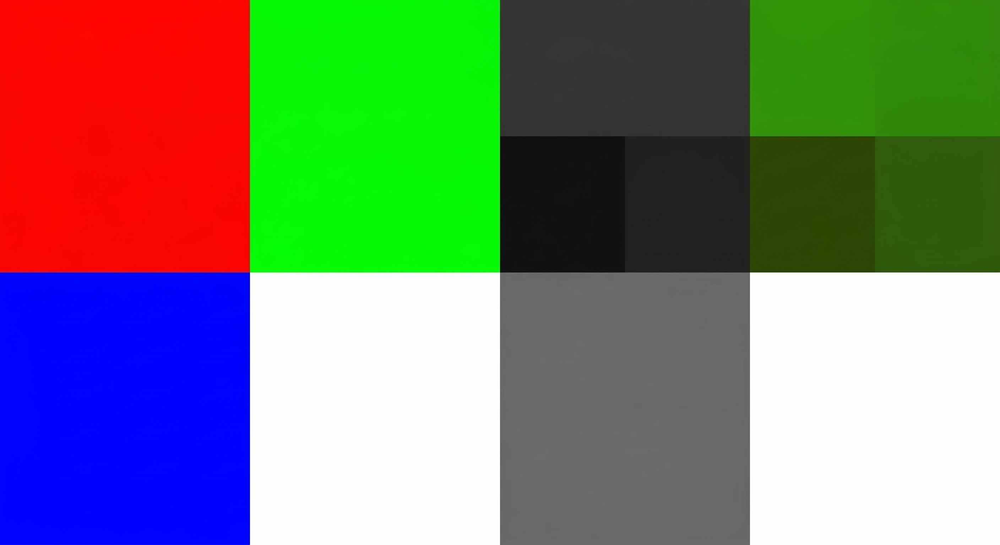
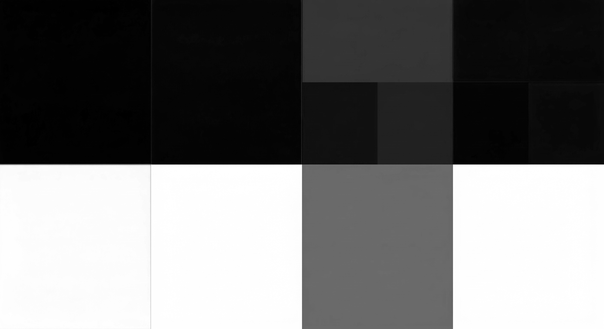
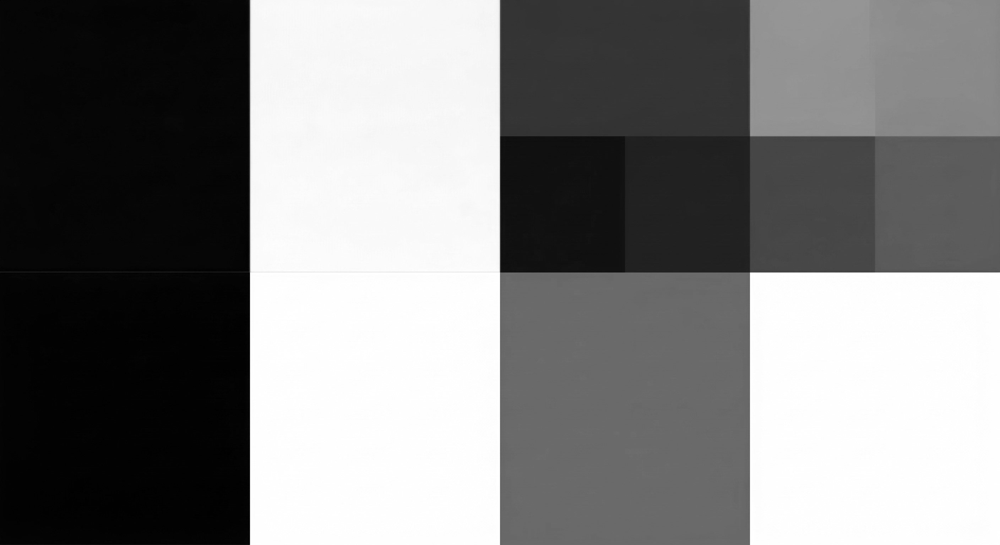
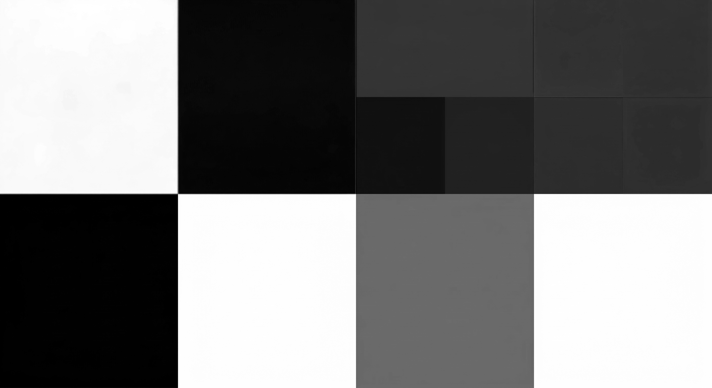
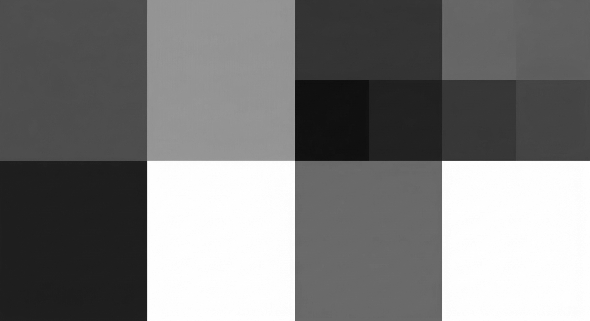

## Kết quả

## Cấu trúc ma trận (Shape) của ảnh

- **Ảnh màu (RGB/BGR):** Có shape dạng (height, width, 3). vì nó được ghép lại từ 3 ma trận màu (Blue, Green, Red).

- **Từng kênh màu (B, G, R) và Ảnh Grayscale:** Có shape dạng (height, width). Khi tách riêng lẻ hoặc khi đã chuyển sang ảnh xám, cấu trúc dữ liệu chỉ còn lại 1 ma trận 2 chiều. Mỗi phần tử trong ma trận mang giá trị cường độ sáng từ 0 đến 255 nghĩa là từ đen sang trắng thể hiện độ sáng tối pixel.

## Thuật toán chuyển đổi ảnh xám

**Option 1:** $(R + G + B)/3$

- Đây là cách tính trung bình cộng đơn giản, chia đều vai trò của 3 màu. Tuy nhiên, nó thường làm bức ảnh xám trông thiếu tự nhiên và bị mờ.

**Option 2:** $0.299R + 0.587G + 0.114B$

- Đây là công thức độ chói. Mắt người nhạy cảm nhất với ánh sáng màu xanh lá và kém nhạy cảm nhất với màu xanh dương. Do đó, việc gán trọng số lớn nhất cho G (0.587) và nhỏ nhất cho B (0.114) sẽ giúp tạo ra bức ảnh grayscale phản ánh đúng độ tương phản và chiều sâu mà mắt người cảm nhận được.
