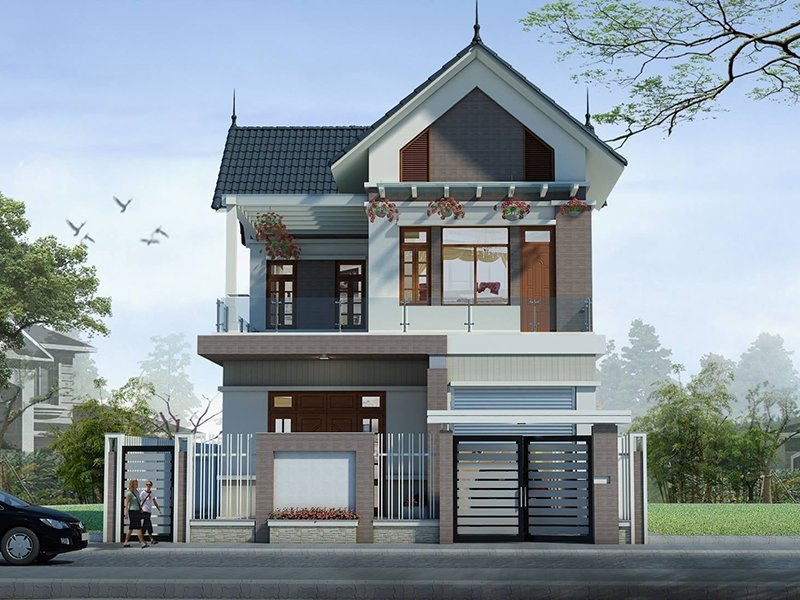

## 1) Mục tiêu
Thực hiện giảm độ phân giải ảnh bằng phép **resampling** với các kích thước: `512x512`, `256x256`, `128x128`, `64x64` và quan sát mức độ mờ/giảm chi tiết của ảnh.

## 2) Nhận xét: độ phân giải thấp thì ảnh mờ đi như thế nào?
Khi giảm độ phân giải, số lượng điểm ảnh (pixel) giảm mạnh nên:

- **Mất chi tiết tần số cao**: cạnh nhỏ, họa tiết mịn, chữ nhỏ bị mất trước.
- **Biên kém sắc nét**: ranh giới vật thể trở nên “nhòe”, không còn rõ cạnh.
- **Hiện tượng bệt khối (pixelation)**: rõ nhất ở mức rất thấp như `64x64`.
- **Giảm khả năng nhận diện chi tiết**: vẫn thấy bố cục tổng thể nhưng khó phân biệt chi tiết nhỏ.

## 3) Liên hệ với nội dung slide về Resolution
Theo lý thuyết về **spatial resolution** trong slide:

- Độ phân giải thể hiện mật độ/thước đo số pixel biểu diễn ảnh.
- Resolution càng cao → ảnh biểu diễn được nhiều thông tin không gian hơn.
- Resolution càng thấp → thông tin bị lấy mẫu thưa hơn, làm mất thành phần chi tiết.
- Nội suy (ở đây dùng `INTER_AREA`) giúp giảm aliasing khi thu nhỏ, nhưng **không thể khôi phục** chi tiết đã mất do giảm mẫu.

Tóm lại: ảnh mờ dần khi giảm resolution vì số mẫu không đủ để giữ các chi tiết tần số cao.

## 4) 5 ảnh minh họa tương ứng

### Ảnh gốc

### Output 512x512

### Output 256x256

### Output 128x128

### Output 64x64

## 5) Kết luận ngắn
- `512x512`: còn khá rõ.
- `256x256`: bắt đầu mất chi tiết nhỏ.
- `128x128`: mờ rõ, biên mềm.
- `64x64`: mất phần lớn chi tiết, chủ yếu còn hình dạng tổng quát.
